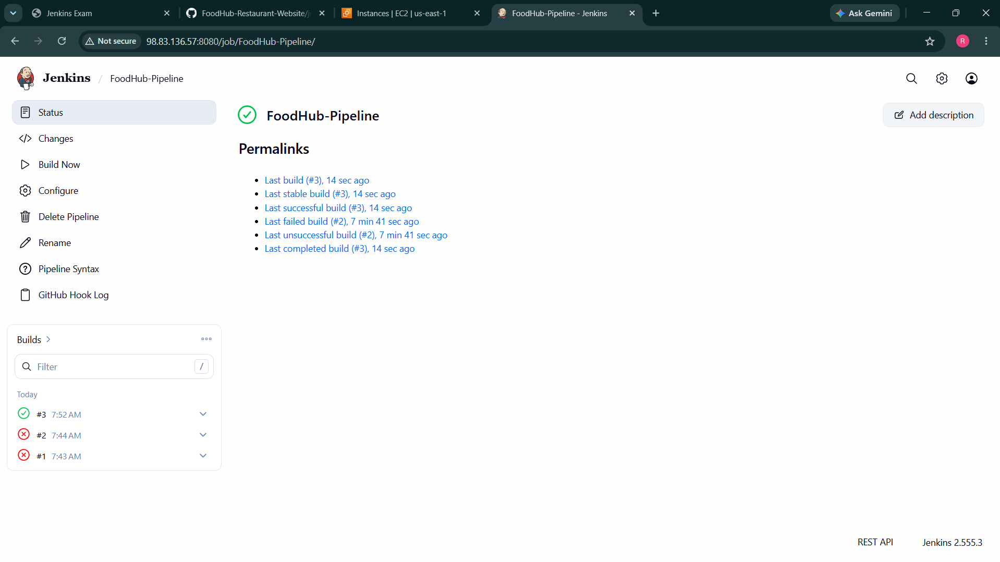
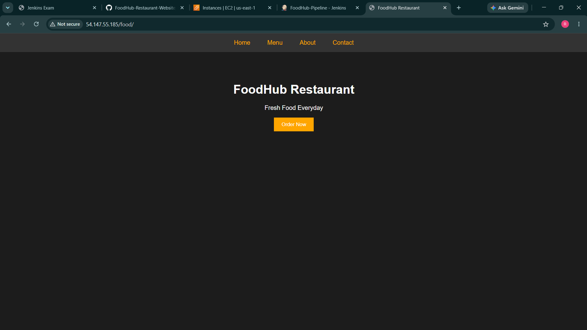
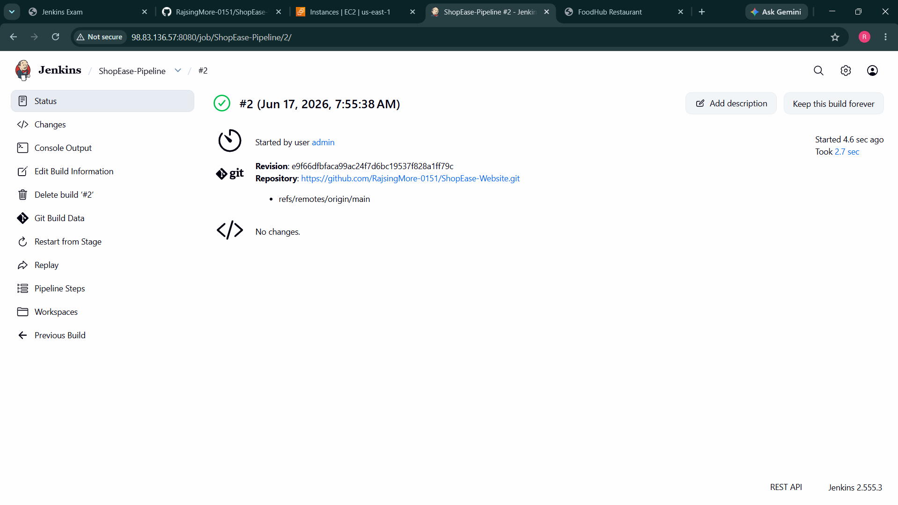
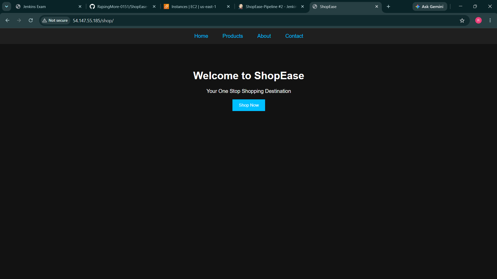
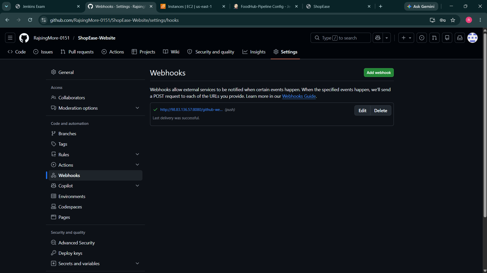
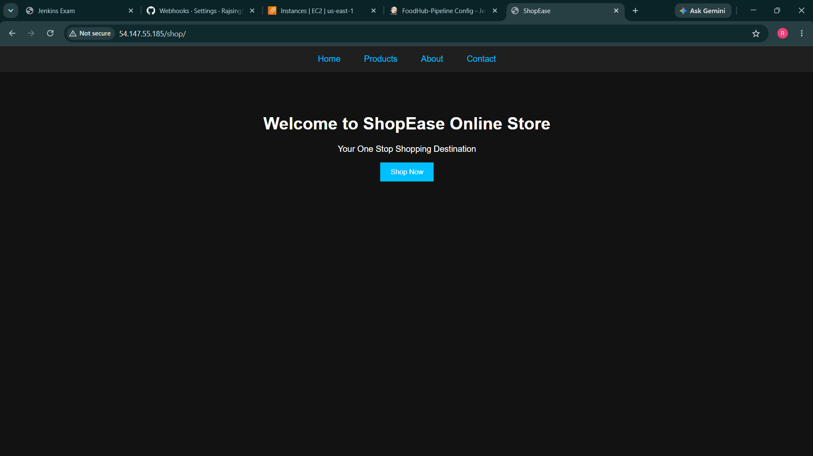
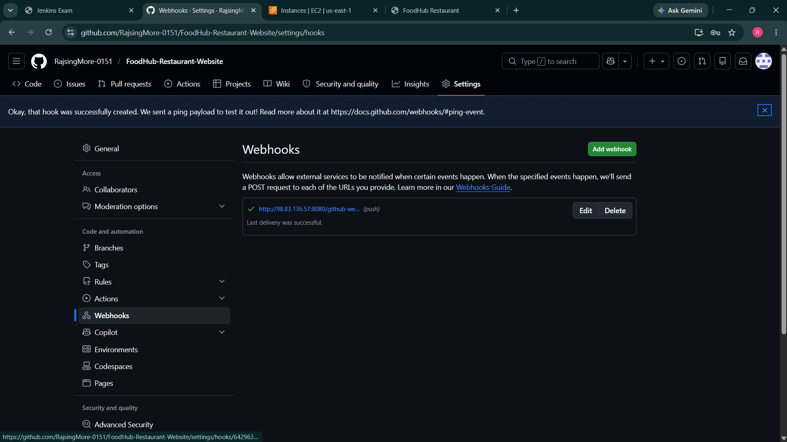
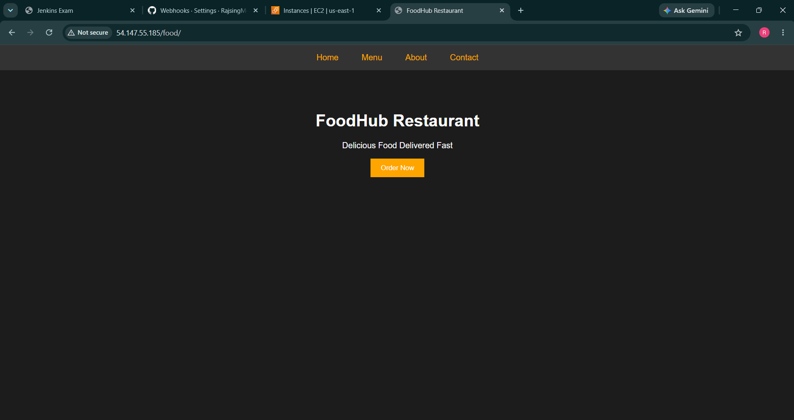

# Jenkins-test
1️⃣ What is Jenkins mainly used for? :- B) Continuous Integration and Continuous Delivery

2️⃣ Which type of job allows you to define build steps using code in Jenkins? :- B) Pipeline Project

3️⃣ Which file is used to define a pipeline in Jenkins? :- C) Jenkinsfile

4️⃣ What is the purpose of a Jenkins Agent (Node)? :- B) To execute jobs assigned by the Jenkins controller

5️⃣ Which plugin is required to connect Jenkins with GitHub? :- B) Git Plugin

6️⃣ What is the purpose of a Webhook in Jenkins CI/CD? :- B) To trigger build automatically on code push

7️⃣ Which command is used inside Jenkins Pipeline to execute shell commands? :- C) sh

8️⃣ What is the purpose of post block in Jenkins Pipeline? :- B) Execute steps after pipeline stages

9️⃣ What is the use of sshagent in Jenkins Pipeline? :- C) Use stored SSH credentials during execution

🔟 What happens if a stage fails in Jenkins Pipeline (by default)? :- B) The pipeline stops execution


# Jenkins CI/CD Practical Test

## Project Overview

This project demonstrates the implementation of a complete CI/CD pipeline using Jenkins for deploying two static websites hosted on GitHub repositories.

The objective was to automate the deployment process so that any code changes pushed to GitHub are automatically built and deployed to a target server using Jenkins pipelines and GitHub webhooks.

---

# Applications

## Application 1 - FoodHub Restaurant Website

Repository:

https://github.com/RajsingMore-0151/FoodHub-Restaurant-Website.git

## Application 2 - ShopEase Website

Repository:

https://github.com/RajsingMore-0151/ShopEase-Website.git

---

# Infrastructure Setup

## Jenkins Server

Installed and configured:

- Java
- Jenkins
- Git
- Required Jenkins Plugins
- SSH Credentials
- GitHub Integration

Verified Jenkins accessibility through browser.

## Target Server

Installed and configured:

- Nginx
- SSH Access
- Port 80 Open
- Website Hosting Directories

Deployment Paths:

```bash
/var/www/html/food
/var/www/html/shop
```

---

# Task 1 - Infrastructure Configuration

### Jenkins Installation

```bash
sudo apt update
sudo apt install openjdk-17-jdk -y

wget -q -O - https://pkg.jenkins.io/debian-stable/jenkins.io-2023.key | sudo tee \
/usr/share/keyrings/jenkins-keyring.asc > /dev/null

echo deb [signed-by=/usr/share/keyrings/jenkins-keyring.asc] \
https://pkg.jenkins.io/debian-stable binary/ | sudo tee \
/etc/apt/sources.list.d/jenkins.list > /dev/null

sudo apt update
sudo apt install jenkins -y
```

### Nginx Installation

```bash
sudo apt update
sudo apt install nginx -y
```

---

# Task 2 - Deploy Both Applications on Same Server

Both applications were deployed on the same EC2 target server using Nginx.

### URLs

FoodHub

```text
http://<TARGET_SERVER_IP>/food
```

ShopEase

```text
http://<TARGET_SERVER_IP>/shop
```

# Task 3 - Jenkins Pipeline Jobs

Created two separate Jenkins Pipeline jobs:

1. FoodHub-Pipeline
2. ShopEase-Pipeline

Each pipeline performs:

- Clone source code from GitHub
- Copy application files to target server
- Deploy application
- Restart nginx
- Verify deployment

---

## FoodHub Pipeline

### Successful Build



### Deployed Website



---

## ShopEase Pipeline

### Successful Build



### Deployed Website



---

# Sample Jenkins Pipeline

```groovy
pipeline {
    agent any

    stages {

        stage('Clone Repository') {
            steps {
                git branch: 'main',
                url: 'https://github.com/<username>/<repo>.git'
            }
        }

        stage('Deploy') {
            steps {
                sh '''
                sudo rm -rf /var/www/html/app/*
                sudo cp -r * /var/www/html/app/
                sudo systemctl restart nginx
                '''
            }
        }
    }
}
```

---

# Task 4 - GitHub Webhook Configuration

Configured GitHub Webhooks for both repositories.

Webhook URL:

```text
http://<JENKINS_SERVER_IP>:8080/github-webhook/
```

Event Trigger:

```text
Just the push event
```

Purpose:

- Any push to GitHub automatically triggers Jenkins.
- Jenkins deploys latest code to target server.

---

## ShopEase Webhook Configuration



### Webhook Delivery Success



---

## FoodHub Webhook Configuration



### Webhook Delivery Success



---

# Task 5 - Application Changes

## FoodHub Website

Modified:

```text
Fresh Food Everyday
```

To:

```text
Delicious Food Delivered Fast
```

Committed and pushed changes to GitHub.

Webhook triggered Jenkins automatically and deployed updated version.

### Verification


---

## ShopEase Website

Modified:

```text
Welcome to ShopEase
```

To:

```text
Welcome to ShopEase Online Store
```

Committed and pushed changes to GitHub.

Webhook triggered Jenkins automatically and deployed updated version.

### Verification


---


# Bonus Task

Configured Nginx so that both applications are accessible through the same server using path-based routing.

### FoodHub

```text
http://<TARGET_SERVER_IP>/food
```

### ShopEase

```text
http://<TARGET_SERVER_IP>/shop
```

No additional ports were required.

---

# Project Architecture

```text
Developer
    │
    ▼
 GitHub Repository
    │
    ▼
 GitHub Webhook
    │
    ▼
 Jenkins Pipeline
    │
    ▼
 Target Server
    │
    ▼
 Nginx Deployment
    │
    ▼
 Website Available on Browser
```

---

# Result

✅ Jenkins Installed and Configured

✅ Nginx Installed and Configured

✅ FoodHub Website Successfully Deployed

✅ ShopEase Website Successfully Deployed

✅ Separate Jenkins Pipelines Created

✅ GitHub Webhooks Configured

✅ Automatic Deployment Working

✅ Required Website Changes Verified

✅ Nginx Path-Based Routing Configured

✅ CI/CD Pipeline Fully Automated

---
